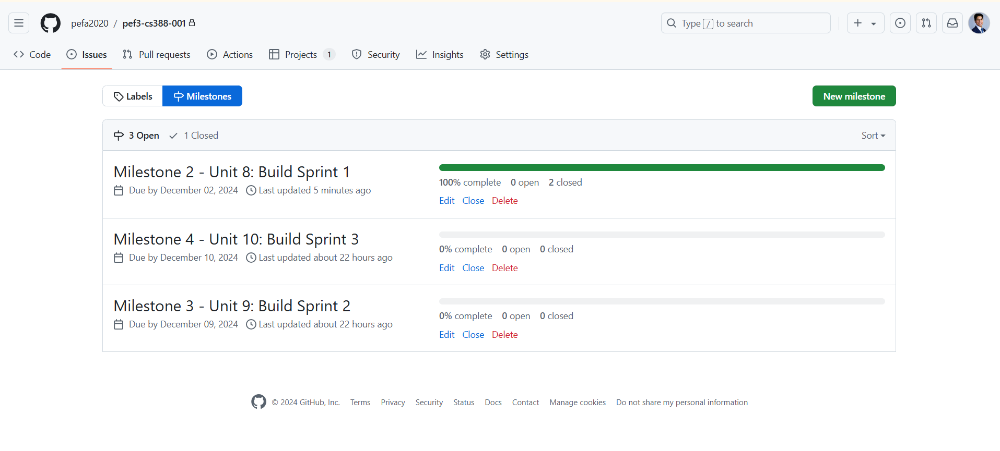
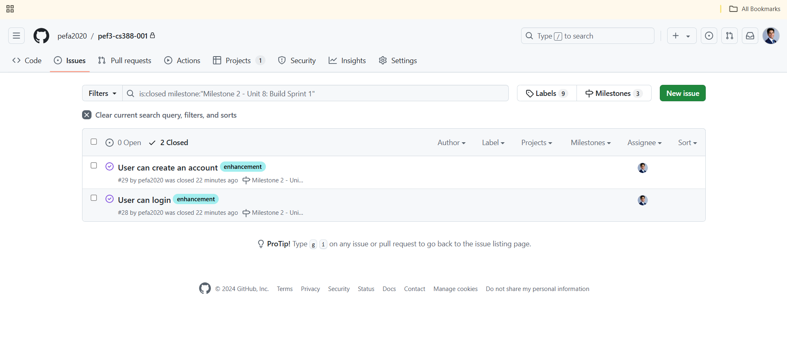
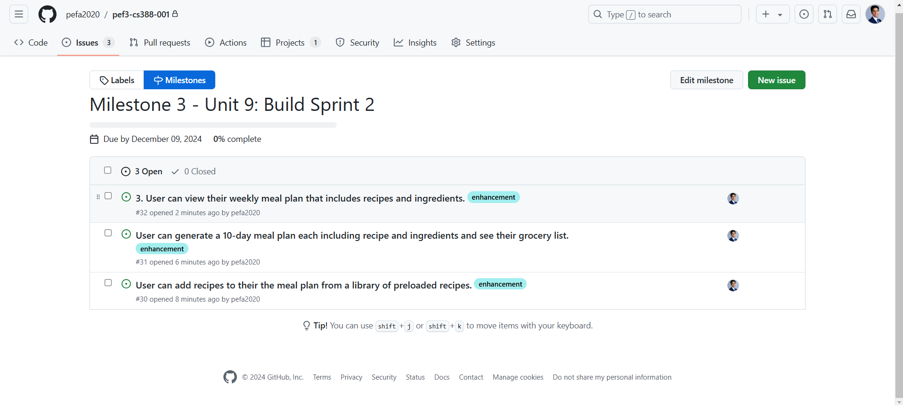
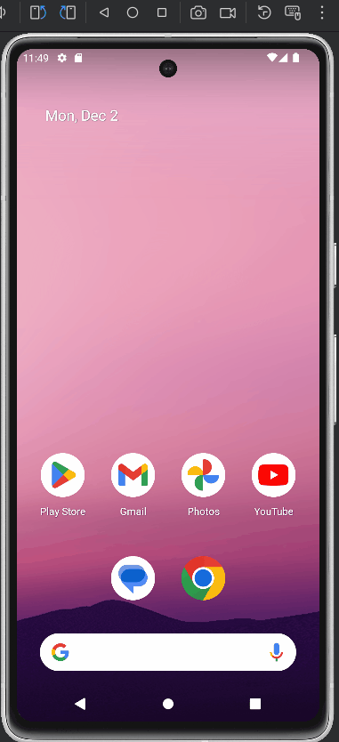
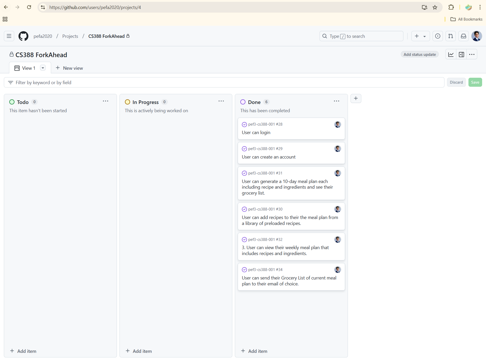

# Milestone 1 - ForkAhead (Unit 7)

## Table of Contents

1. [Overview](#Overview)
1. [Product Spec](#Product-Spec)
1. [Wireframes](#Wireframes)

## Overview

### Description

A meal planning app that simplifies cooking by generating a 10-day recipe plan, grocery list, and daily cooking reminders, perfect for busy home cooks and families.

### App Evaluation

  - **Category:** Food & Lifestyle

   - **Mobile:**
       - How uniquely mobile is the product experience? 
           - The app leverages mobile push notifications for daily recipe reminders and integrates a touch-friendly interface for meal selection and grocery list management, ideal for on-the-go use while shopping or cooking.
       - What makes your app more than a glorified website?
           - Offline functionality for accessing meal plans and grocery lists, real-time notifications, and an intuitive design tailored for quick navigation ensure a mobile-first experience.
   - **Story:**
       - How compelling is the story around this app once completed?
           - ForkAhead addresses a relatable pain point—"What should I cook today?"—with a seamless and stress-free solution, making it highly compelling to families and busy individuals.
      - How clear is the value of this app to your audience?
           - Its value is clear: simplifying meal planning and grocery shopping while reducing food waste and decision fatigue.
      - How well would your friends or peers respond to this product idea?
           - Most users, especially home cooks and parents, would find it practical and time-saving, making it appealing to peers juggling busy schedules.
   - **Market:**
       - How large or unique is the market for this app?
           - The app targets the vast market of home cooks, including families, young professionals, and even small-scale food entrepreneurs—a market large enough to sustain growth.
       - What’s the size and scale of your potential user base?
           - Millions of home cooks worldwide, with potential scalability to restaurant staff or catering services in future iterations.
       - Does this app provide huge value to a niche group of people?
           - Yes, it offers immense value to time-strapped individuals and families who struggle with meal planning and grocery preparation.
       - Do you have a well-defined audience of people for this app?
           - The primary audience includes busy parents, professionals, and beginner cooks who value convenience and organization.
   - **Habit:**
       - How habit-forming or addictive is this app?
           - Daily cooking notifications and organized meal planning encourage users to rely on the app regularly, forming consistent habits.
       - How frequently would an average user open and use this app? 
           - Users would likely open it multiple times per week to review meal plans, check grocery lists, and follow recipe instructions.
       - Does an average user just consume your app or do they create?
           - Users actively interact by selecting meal plans, customizing serving sizes, and managing grocery lists, making it highly engaging.
   - **Scope:**
       - How well-formed is the scope for this app?
           - The app has a clear and achievable scope with three core features—meal planning, grocery list generation, and notifications—ensuring simplicity and usability.
       - How technically challenging will it be to complete this app by the end of the program?
           - It is beginner-friendly, requiring CRUD operations, Firebase for notifications and database storage, and basic API integration (Spoonacular).
       - Is a stripped-down version of this app still interesting to build?
           - Yes, even a minimal version with static recipes, grocery lists, and notifications provides significant value to users.
       - How clearly defined is the product you want to build?
           - The product is well-defined with a focus on simplicity, practicality, and ease of use, making it both unique and achievable.

## Product Spec

### 1. User Features (Required and Optional)

**Required Features**

1. User can generate a 10-day meal plan each including recipe and ingredients and see their grocery list.
2. User can visualize the recipe (with ingredients) they are assigned each day.
3. User can view their weekly meal plan that includes recipes and ingredients.
4. User can add recipes to their the meal plan from a library of preloaded recipes.
5. User can login.
6. User can create a new account.

**Optional Features**

1. User can customize meal plans by replacing or rearranging specific recipes.
2. Users can create their own recipe and add their ingredients.
3. User can rate recipes or save favorites to use in future meal plans.

### 2. Screen Archetypes
- Login Screen
  - User can login
- Registration Screen
  - User can create a new account
- Stream
  - Users can see their current meal plan
  - Users get notified when it's time to update their plan
- Details
  - Users can see detailed information about a specific meal within the plan
- Creation
  - Users can customize their meal plans with the ability to add, remove, or edit meals
  

### 3. Navigation

**Tab Navigation** (Tab to Screen)

* Home Feed (shows the daily recipe, for the user to cook)
* Overview (displays current 10-day plan)
* Create (new 10-day Plan)
* Profile & Metrics

**Flow Navigation** (Screen to Screen)

- Home
  - => Home
- Registration Screen
  - => Home
- Home Screen
  - => Home (if you click the "Home" tab button)
  - => Overview (if you clicked the "Paragraph" tab button)
  - => Overview of Detailed Meal (if you clicked on an Item from RecyclerView at Overview Tab)
  - => Create (if you clicked the "Plus" tab button)
  - => Profile & Metrics (if you clicked the "User" tab button)
- Profile & Metrics
  - => Login Screen (if you clicked the "Logout" button)
- Create
  - => Ingredient & Quantities Summary Screen (if you clicked the "Add New Plan" button)

## Wireframes

 

 

### [BONUS] Digital Wireframes & Mockups

### [BONUS] Interactive Prototype

 

# Milestone 2 - Build Sprint 1 (Unit 8)

## GitHub Project board

[Add screenshot of your Project Board with three milestones visible in
this section]

## Issue cards

- [Add screenshot of your Project Board with the issues that you've been working on for this unit's milestone] 
- [Add screenshot of your Project Board with the issues that you're working on in the **NEXT sprint**. It should include issues for next unit with assigned owners.] 

## Issues worked on this sprint

- List the issues you completed this sprint
- Issues worked on Sprint 1 (Milestone 2):
  - [x] User can login.
  - [x] User can logout.
  - [x] User can create a new account.
- [Add giphy that shows current build progress for Milestone 2. Note: We will be looking for progression of work between Milestone 2 and 3. Make sure your giphys are not duplicated and clearly show the change from Sprint 1 to 2.]

 

# Milestone 3 - Build Sprint 2 (Unit 9)

## GitHub Project board

[Add screenshot of your Project Board with the updated status of issues for Milestone 3. Note that these should include the updated issues you worked on for this sprint and not be a duplicate of Milestone 2 Project board.] 

## Completed user stories

- List the completed user stories from this unit (Milestone 3):
- [x] User can generate a 10-day meal plan each including recipe and ingredients and see their grocery list.
- [x] User can add recipes to their the meal plan from a library of preloaded recipes.
- [x] User can view their weekly meal plan that includes recipes and ingredients.
- [x] User can send their Grocery List of current meal plan to their email of choice.
- From Milestone 2 (Already Done):
- [x] User can login.
- [x] User can logout.
- [x] User can create a new account.
- List any pending user stories / any user stories you decided to cut
from the original requirements
- Pending from Original Requirements:
- [ ] User can visualize the recipe (with ingredients) they are assigned each day.
- Cut:
- User can rate recipes or save favorites to use in future meal plans.
- Insead of the above, I did:
- [x] User can send their Grocery List of current meal plan to their email of choice.
- Optionals pending:
- [ ] User can customize meal plans by replacing or rearranging specific recipes.
- [ ] Users can create their own recipe and add their ingredients.

[Add video/gif of your current application that shows build progress]

## App Demo Video

- Embed the YouTube/Vimeo link of your Completed Demo Day prep video
- LINK: [https://youtu.be/CRe1gDqgUNo](url)

- Milestone 4 Completed Core Feature (last one):
- [x] User can visualize the recipe (with ingredients) they are assigned each day.
